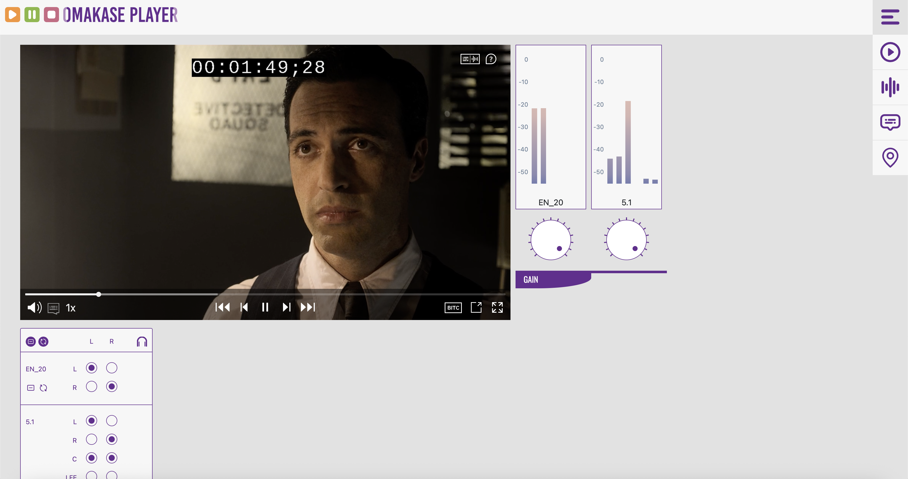
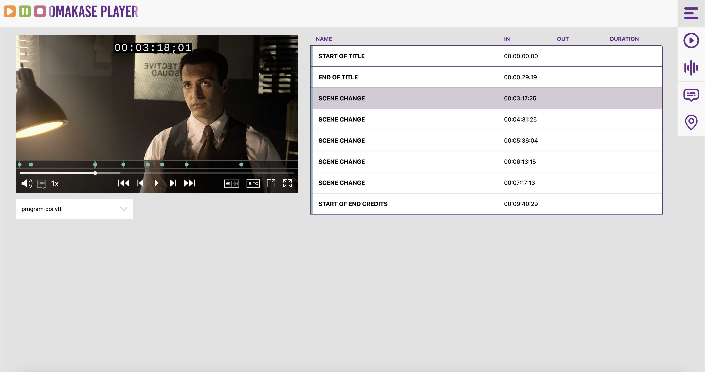

# Omakase Player Components Demo

Omakase Player Components Demo showcases showcaes various use cases using the Omakase Player. Load main media and sidecars to explore the demo capabilities.

## Development

Run following commands to start angular development server and use Omakase player components demo at [http://localhost:4200](http://localhost:4200):

```
npm i
ng serve
```

The application will automatically reload when you make changes to any source files.

## Build

`npm run build:dev` - builds an app for development

`npm run build:prod` - builds an app for production

## Layouts

### Simple Layout

- Omakase player with player chroming (default theme) enabled
- Implements main and sidecar media loading
- Showcases simple audio and text track selection
- Implements basic player hotkeys

Layout allows loading of multiple audio and subtitle sidecars with the ability to play one audio track and display one subtitle track.


### Audio Layout

- Omakase player with chroming enabled, vu meter, and stacked router
- Implements main and sidecar media loading
- Implements router and vu meter visualization for main media and sidecare audio
- Implements per track gain control
- Implements basic player hotkey support

Layout allows loading of multiple audio and subtitle sidecars with the ability to play multiple audio tracks and display one subtitle track.



### Marker Layout

- Omakase player with player chroming enabled, marker list component, media chrome marker bar
- Implements main and sidecar media (including marker tracks) loading
- Implements marker list component initialization
- Implements marker track creation (media chrome marker bar) inside player's chroming

Layout allows loading of multiple audio and subtitle sidecars with the ability to play one audio track and display one subtitle track. It supports visualization of one marker track through marker list component and player's chroming



## Basic Operation

Use the menu in upper right to select a layout. Main media, sidecar media and marker tracks are loaded via the icons positioned on the right.

Supplied marker tracks should follow a WebVTT format.
When resolving marker name the following logic is used:

- Cue text is stripped of html and json objects
- Text associated with first `:COMMENT` is located / used
- If there is no `:COMMENT`, the entire stripped cue as is used
- If there is no text in stripped cue, the marker is assigned the value `Marker {number}`

A following is an example of a valid marker track:

```
WEBVTT

NOTE
Omakase Player Web VTT
V1.0

00:03:24.576 --> 00:03:54.623
:COMMENT=Something <span class="itallic">interesting</span>

00:07:50.076 --> 00:08:20.090
Using JSON {"comment": "I will be ignored"}

00:10:41.676 --> 00:11:11.690
{"comment": "I will also be ignored"}
```

The marker names would be `Something interesting`, `Using JSON` and `Marker 3` respectively.

## Content

Currently supported media formats are:

| Media type    | Formats       |
| ------------- | ------------- |
| Main media    | M3U8, MP4     |
| Sidecar audio | AAC, AC3, MP4 |
| Sidecar text  | VTT           |
| Marker track  | VTT           |

To make this app easier to use, we included a few links of various media and sidecars:

### Main Media

- [Meridian main media](https://github-media.assets.byomakase.org/meridian_en_720p24.mp4)

### Sidecar Audio

- [Meridian 5.1 English](https://github-media.assets.byomakase.org/meridian_en_51.aac)
- [Meridian 2.0 Spanish](https://github-media.assets.byomakase.org/meridian_es_20.aac)
- [Meridian 2.0 French](https://github-media.assets.byomakase.org/meridian_fr_20.aac)
- [Meridian 2.0 Portuguese ](https://github-media.assets.byomakase.org/meridian_pt_20.aac)

### Sidecar Text

- [Meridian English CC](https://github-media.assets.byomakase.org/meridian_en_cc.vtt)
- [Meridian Spanish subtitles](https://github-media.assets.byomakase.org/meridian_es.vtt)
- [Meridian French subtitles](https://github-media.assets.byomakase.org/meridian_fr.vtt)
- [Meridian Portuguese subtitles](https://github-media.assets.byomakase.org/meridian_pt.vtt)

### Marker Track

- [Meridian scenes marker track](https://github-media.assets.byomakase.org/meridian-scenes.vtt)
- [Meridian points of interest marker track](https://github-media.assets.byomakase.org/meridian-poi.vtt)

## Links

- [Omakase player](https://player.byomakase.org/)
- [Omakase player repo](https://github.com/byomakase/omakase-player)
- [Omakase player demo](https://demo.player.byomakase.org/)
- [Reference player](https://reference.player.byomakase.org/?session=https:%2F%2Fmanifest.assets.byomakase.org%2Fdemo%2Frp-demo1-v6.json)
- [Vu meter](https://github.com/byomakase/vu-meter)

## Known Limitiations

- Main media audio routing is not supported in Safari

## Further Help

- CORS must taken into account when loading media and sidecars from a different origin
