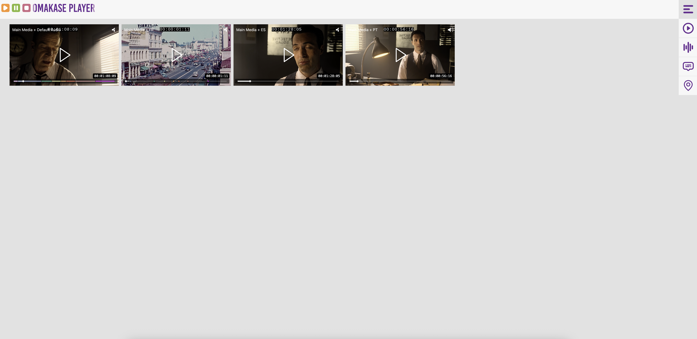

# Omakase Player Components Demo

Omakase Player Components Demo showcases showcaes various use cases using the Omakase Player. Load main media and sidecars to explore the demo capabilities.

## Development

Run following commands to start angular development server and use Omakase player components demo at [http://localhost:4200](http://localhost:4200):

```
npm i
ng serve
```

The application will automatically reload when you make changes to any source files.

## Build

`npm run build:dev` - builds an app for development

`npm run build:prod` - builds an app for production

## Layouts

### Simple Layout

- Omakase player with player chroming (default theme) enabled
- Implements main and sidecar media loading
- Showcases simple audio and text track selection
- Implements basic player hotkeys

Layout allows loading of multiple audio and subtitle sidecars with the ability to play one audio track and display one subtitle track.


### Audio Layout

- Omakase player with chroming enabled, vu meter, and stacked router
- Implements main and sidecar media loading
- Implements router and vu meter visualization for main media and sidecare audio
- Implements per track gain control
- Implements basic player hotkey support

Layout allows loading of multiple audio and subtitle sidecars with the ability to play multiple audio tracks and display one subtitle track.


### Marker Layout

- Omakase player with player chroming enabled, marker list component, media chrome marker bar
- Implements main and sidecar media (including marker tracks) loading
- Implements marker list component initialization
- Implements marker track creation (media chrome marker bar) inside player's chroming

Layout allows loading of multiple audio and subtitle sidecars with the ability to play one audio track and display one subtitle track. It supports visualization of one marker track through marker list component and player's chroming


### Timeline Layout

- Omakase player with player chroming enabled, marker list component and timeline
- Implements main and sidecar media (including marker tracks) loading
- Implements marker list component initialization
- Implements timeline creation and customization

Layout allows loading of multiple audio and subtitle sidecars with the ability to play one audio track and display one subtitle track. It supports visualization of multiple marker tracks through marker list component and timeline lanes. It supports subtitle visualization using the timeline lane.


### Stamp Layout

- Omakase player with stamp player chroming enabled
- Implements main and sidecar media (including marker tracks) loading

Layout allows loading of multiple audio and marker track sidecars. For each loaded audio sidecar it creates a new instance of stamp Omakase player and displays a marker track if there is one (that is not displayed in other stamp players)



### Chromeless Layout

- Omakase player with player chroming disabled and custom control panel
- Implements main and sidecar media loading
- Implements custom control panel showcasing how to leverage Omakase player API to develop fully custom controls

Layout allows loading of multiple audio and subtitle sidecars with the ability to play one audio track and display one subtitle track.


## Basic Operation

Use the menu in upper right to select a layout. Main media, sidecar media, marker tracks and observation tracks are loaded via the icons positioned on the right.

Supplied marker tracks should follow a WebVTT format.
When resolving marker name the following logic is used:

- Cue text is stripped of html and json objects
- Text associated with first `:COMMENT` is located / used
- If there is no `:COMMENT`, the entire stripped cue is used
- If there is no text in stripped cue, the marker is assigned the value `Marker {number}`

The following is an example of a valid marker track:

```
WEBVTT

NOTE
Omakase Player Web VTT
V1.0

00:03:24.576 --> 00:03:54.623
:COMMENT=Something <span class="itallic">interesting</span>

00:07:50.076 --> 00:08:20.090
Using JSON {"comment": "I will be ignored"}

00:10:41.676 --> 00:11:11.690
{"comment": "I will also be ignored"}
```

In the above example, the marker names would be `Something interesting`, `Using JSON` and `Marker 3` respectively.

Two observation tracks formats are supported. The first format is OMP WebVTT. It allows multiple measurements to be associated with each cue. It also allows comments to be associated with a measurement. The following is an example of valid observation track in OMP WebVTT format:

```
WEBVTT

NOTE
Omakase Player Web VTT
V1.0

00:00:0.01 --> 00:00:10.00
0.2:MEASUREMENT=average
0.4:MEASUREMENT=max:COMMENT=A comment or a note about the cue
0.2:COMMENT=min
:COMMENT=This is a comment among the measurements

00:00:10.01 --> 00:00:20.00
0.3:MEASUREMENT=average
0.8:MEASUREMENT=max
0.2:MEASUREMENT=min
```

A simpler, single statistic observation track, can be represented using a standard WebVTT. The following is an example of valid observation in WebVTT format:

```
WEBVTT

NOTE
duration: 11m58s
mode: VTT
density: 30
min-max: False

00:00:00.000 --> 00:00:01.999
472145.242

00:00:02.000 --> 00:00:03.999
876157.992

00:00:04.000 --> 00:00:05.999
873522.742
```

## Content

Currently supported media formats are:

| Media type        | Formats       |
|-----------------|---------------|
| Main media        | M3U8, MP4     |
| Sidecar audio     | AAC, AC3, MP4 |
| Sidecar text      | VTT           |
| Marker track      | VTT           |
| Thumbnail track   | VTT           |
| Observation track | VTT           |

To make this app easier to use, we have included links to various media and sidecars:

### Main Media

- [Meridian main media](https://github-media.assets.byomakase.org/meridian_en_720p24.mp4)

### Sidecar Audio

- [Meridian 5.1 English](https://github-media.assets.byomakase.org/meridian_en_51.aac)
- [Meridian 2.0 Spanish](https://github-media.assets.byomakase.org/meridian_es_20.aac)
- [Meridian 2.0 French](https://github-media.assets.byomakase.org/meridian_fr_20.aac)
- [Meridian 2.0 Portuguese ](https://github-media.assets.byomakase.org/meridian_pt_20.aac)

### Sidecar Text

- [Meridian English CC](https://github-media.assets.byomakase.org/meridian_en_cc.vtt)
- [Meridian Spanish subtitles](https://github-media.assets.byomakase.org/meridian_es.vtt)
- [Meridian French subtitles](https://github-media.assets.byomakase.org/meridian_fr.vtt)
- [Meridian Portuguese subtitles](https://github-media.assets.byomakase.org/meridian_pt.vtt)

### Marker Track

- [Meridian Scene Marker Track](https://github-media.assets.byomakase.org/meridian-scenes.vtt)
- [Meridian Scene Change Marker Track](https://github-media.assets.byomakase.org/meridian-poi.vtt)
- [Meridian Mac Character On-Screen Marker Track](https://github-media.assets.byomakase.org/meridian_onscreen-mac_period_omp_11m58s.vtt)
- [Meridian Jake Character On-Screen Marker Track](https://github-media.assets.byomakase.org/meridian_onscreen-jake_period_omp_11m58s.vtt)
- [Meridian Woman Character On-Screen Marker Track](https://github-media.assets.byomakase.org/meridian_onscreen-woman_period_omp_11m58s.vtt)

### Observation Track
- [Meridian Min-Max-Average Video Bitrate Observation Track](https://github-media.assets.byomakase.org/meridian_video_bitrate_2-sec_min_max_omp_11m58s.vtt)
- [Meridian Random Data Observation Track](https://github-media.assets.byomakase.org/meridian_random_0_to_100_2-sec_omp_11m58s.vtt)

### Thumbnail Track

- [Meridian thumbnail track](https://github-media.assets.byomakase.org/meridian_en_720p24/thumbnails/thumbnails.vtt)

## Links

- [Omakase player](https://player.byomakase.org/)
- [Omakase player repo](https://github.com/byomakase/omakase-player)
- [Omakase player demo](https://demo.player.byomakase.org/)
- [Reference player](https://reference.player.byomakase.org/?session=https:%2F%2Fmanifest.assets.byomakase.org%2Fdemo%2Frp-demo1-v6.json)
- [Vu meter](https://github.com/byomakase/vu-meter)

## Known Limitations

- Main media audio routing is not supported in Safari

## Further Help

- CORS must taken into account when loading media and sidecars from a different origin
